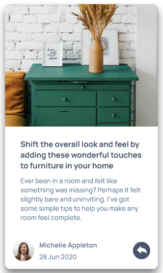

# Frontend Mentor - Article preview component solution

This is a solution to the [Article preview component challenge on Frontend Mentor](https://www.frontendmentor.io/challenges/article-preview-component-dYBN_pYFT). Frontend Mentor challenges help you improve your coding skills by building realistic projects.

## Table of contents

- [The challenge](#the-challenge)
- [Screenshot](#screenshot)
- [Links](#links)
- [Built with](#built-with)
- [Continued development](#continued-development)
- [Useful resources](#useful-resources)
- [Author](#author)

### The challenge

Users should be able to:

- View the optimal layout for the component depending on their device's screen size
- See the social media share links when they click the share icon

### Screenshot

### Links

- Solution URL: [Github](https://github.com/0300hrs/Article-preview-component)
- Live Site URL: [Github Pages](https://0300hrs.github.io/Article-preview-component/)

### Built with

- Semantic HTML5 markup
- CSS custom properties
- Flexbox
- Mobile-first workflow

### Continued development

Getting my Javascript DOM manipulation skills down would be beneficial in coding more complex project in the future. So I'll be taking on challenges that involved Javascript DOM maipulation especially projects that involve class and input manipulation.

### Useful resources

- [MDN](https://developer.mozilla.org/en-US/docs/Learn/HTML) - This helped me for get syntax in building the modal function.

## Author

- Website - [Abdulmalik](https://0300hrs.github.io/personal-portfolio/)
- Frontend Mentor - [@yourusername](https://www.frontendmentor.io/profile/0300hrs)
- Twitter - [@day_by_friday](https://www.twitter.com/day_by_friday)
